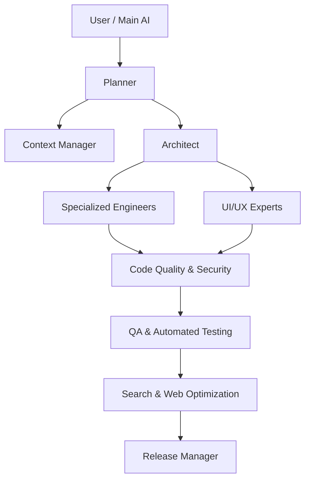

# subagents-ide (`@fairoz9961/subagents-ide`) — v2.0 🚀

> **Next-Generation Ecosystem of 40+ Specialized AI Experts & Intelligent Stack Auto-Routing** across **ALL major AI coding tools & IDEs** (Antigravity, Cursor, Claude Code, Windsurf, Cline, Roo Code, Copilot, Devin, and Codex).

[](https://www.npmjs.com/package/@fairoz9961/subagents-ide)
[](LICENSE)

---

## 💡 Quick Start

In any project repository, run:

```bash
npx @fairoz9961/subagents-ide
```

### Modes & Flags
- `npx @fairoz9961/subagents-ide` — **Intelligent Stack Auto-Routing**: Automatically inspects your codebase (Next.js, React, Node, Laravel, Python, Flutter, Docker, Kubernetes) and deploys only the relevant subagents.
- `npx @fairoz9961/subagents-ide --all` — **Complete Ecosystem**: Deploys all 40+ specialized subagents.

---

## 🌐 Multi-IDE & AI Tool Support

Every generated subagent is natively formatted for your AI tools:
- 🤖 **Antigravity / Gemini**: `.agents/agents/*.md`
- ⚡ **Cursor IDE**: `.cursor/rules/*.mdc`
- 🧠 **Claude Code**: `CLAUDE.md`
- 🛠️ **Cline & Roo Code**: `.clinerules` & `.roomodes`
- 🐙 **GitHub Copilot**: `.github/copilot-instructions.md`
- 🏄 **Windsurf Cascade**: `.windsurfrules`

---

## 🧠 Ecosystem Architecture (40+ Specialized Experts)



### 1. Core Workflow
- **`planner`** — Deconstructs high-level requests into strategic roadmaps, agent directives, and execution phases.
- **`architect`** — System design, modular boundaries, and implementation plans without writing direct production code.
- **`engineer`** — Implements features, writes production-ready code, and resolves lint errors from specifications.
- **`reviewer`** — PR reviews, code quality, security standards, and design adherence.
- **`tester`** — Executes automated and manual test strategies and verifies defect resolutions.

### 2. Architecture & Design
- **`system-designer`** — Distributed systems, microservices topology, message queues, and high availability systems.
- **`infrastructure-architect`** — Cloud infrastructure, VPC networking, security perimeters, and IAM topologies.
- **`database-architect`** — Relational/NoSQL schemas, data modeling, indexing strategies, and migration scripts.
- **`api-architect`** — RESTful, GraphQL, gRPC API contracts, OpenAPI specs, rate-limiting schemas.

### 3. Engineering Specialists
- **`backend-engineer`** — Server-side logic, API integrations, data access layers, and middleware.
- **`frontend-engineer`** — Client-side web apps, state management, modern Web APIs (React, Vue, Next.js, Svelte).
- **`mobile-engineer`** — Native iOS/Android (Swift/Kotlin), React Native, and Flutter cross-platform applications.
- **`ai-engineer`** — LLM model integrations, inference pipelines, function calling, streaming, and agentic loops.
- **`cloud-engineer`** — Serverless functions (AWS Lambda/GCP Cloud Run), container services, and cloud resources.
- **`devops-engineer`** — CI/CD pipelines, Docker containers, Kubernetes manifests, and infrastructure automation.
- **`data-engineer`** — Data pipelines, ETL/ELT workflows, stream processing, and data warehouse models.

### 4. Code Quality & Security Auditing
- **`refactoring-expert`** — Eliminates code smells, applies design patterns (SOLID/DRY), and reduces tech debt safely.
- **`performance-expert`** — Profiles execution speed, memory usage, CPU bottlenecks, tree-shaking, and bundle size.
- **`security-auditor`** — Vulnerability assessments (OWASP Top 10), dependency auditing, and secret leak scanning.

### 5. Testing & QA
- **`qa-engineer`** — End-to-end quality assurance strategies, test matrices, and defect verification.
- **`automation-tester`** — Playwright, Cypress, Jest, Vitest, and PyTest automated test suites.
- **`accessibility-tester`** — WCAG 2.2 AA/AAA compliance, ARIA attributes, keyboard navigation, and screen reader audits.

### 6. Documentation
- **`technical-writer`** — Technical architecture documentation, developer onboarding guides, and manuals.
- **`api-doc-writer`** — OpenAPI/Swagger specifications, Postman collections, and integration tutorials.
- **`readme-generator`** — High-converting GitHub README.md files with shields, architecture diagrams, and quickstart guides.

### 7. DevOps & Infrastructure
- **`docker-expert`** — Multi-stage Dockerfiles, minimal base images, container security, and docker-compose setups.
- **`kubernetes-expert`** — Production K8s manifests, Helm charts, ingress controllers, HPA scaling policies, and cluster configs.
- **`github-actions-expert`** — GitHub Actions automation workflows, matrix builds, custom actions, and release pipelines.

### 8. AI & LLM Specialists
- **`prompt-engineer`** — System prompts, few-shot instruction tuning, anti-hallucination guardrails, and token efficiency.
- **`rag-expert`** — Document chunking, hybrid vector+lexical search, reranking, and RAG pipelines.
- **`vector-db-expert`** — Pinecone, Qdrant, Weaviate, Chroma, and Pgvector index strategies (HNSW/IVF).
- **`mcp-expert`** — Model Context Protocol (MCP) servers, JSON-RPC tool schemas, resources, and clients.
- **`skill-downloader`** — Stack inspection & automatic installation of skills, MCPs, templates, and workflows.

### 9. Search & Web Optimization (SEO / AEO / GEO / OE / SXO / CRO)
- **`search-optimization-expert`**:
  - **SEO (Search Engine Optimization)**: Title tags, meta descriptions, semantic HTML5, canonical URLs, XML sitemaps, robots.txt.
  - **AEO (Answer Engine Optimization)**: Q&A formats, FAQ schemas, summaries, and entity linking for Perplexity, ChatGPT, Gemini, Copilot.
  - **GEO (Generative Engine Optimization)**: JSON-LD (Schema.org), Knowledge Graph relationships, rich snippets, and LLM metadata.
  - **OE (Organic Optimization)**: Core Web Vitals (CLS, LCP, INP), image optimization, caching, bundle splitting, and lazy loading.
  - **SXO & CRO**: Search Experience UX navigation, accessibility, landing page CTAs, and funnel optimization.

### 10. UI/UX & Design
- **`ui-designer`** — Visual hierarchy, color palettes, typography, glassmorphic themes, and modern web aesthetics.
- **`ux-designer`** — Intuitive user journeys, wireframes, navigation structures, and friction-free interaction flows.
- **`design-system-expert`** — Atomic component design systems, design tokens, and CSS custom properties.
- **`tailwind-expert`** — Utility-first UI components, custom Tailwind plugins, and responsive breakpoint layouts.

### 11. Business & Management
- **`product-manager`** — User story mapping, feature requirements, and acceptance criteria.
- **`project-manager`** — Sprint progress tracking, task delegation, dependency resolution, and milestone delivery.
- **`release-manager`** — Semantic versioning (vX.Y.Z), release checklists, changelogs, and deployment validation.

### 12. Context & Read-Only Research Experts
- **`context-manager`** — Maintains codebase dependency graphs, tracks file changes, prevents context loss, and supplies architecture maps without altering code.
- **`memory-manager`** — Stores and retrieves architectural decision records (ADRs), naming conventions, and historical bug fixes.
- **`doc-researcher`** — Analyzes third-party documentation, API specifications, and framework manuals.

---

## 🔍 Intelligent Tech Stack Auto-Routing

When you run `npx @fairoz9961/subagents-ide` without arguments:
- **Next.js / React**: Activates `frontend-engineer`, `tailwind-expert`, `search-optimization-expert`, `accessibility-tester`, `performance-expert`, `ui-designer`.
- **Node / Express / Nest**: Activates `backend-engineer`, `api-architect`, `database-architect`.
- **Laravel / PHP**: Activates `backend-engineer`, `database-architect`, `api-architect`, `security-auditor`.
- **Flutter / Mobile**: Activates `mobile-engineer`, `ui-designer`, `qa-engineer`.
- **Python / AI**: Activates `ai-engineer`, `prompt-engineer`, `rag-expert`, `vector-db-expert`, `mcp-expert`.
- **Docker / Kubernetes**: Activates `devops-engineer`, `docker-expert`, `github-actions-expert`.

---

## 📄 License

This project is open source software licensed under the [MIT License](LICENSE).

Copyright (c) 2026 Fairoz ([fairoz9961](https://github.com/Fairoz007)).
