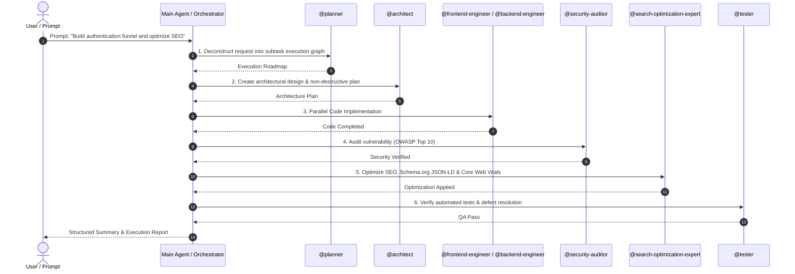

# @fairoz9961/subagents-ide (`subagents`) — v2.1.0 🚀

> **Autonomous Multi-Agent Orchestrator & Ecosystem of 44+ Specialized AI Experts** across **ALL major AI coding tools & IDEs** (Antigravity, Cursor, Claude Code, Windsurf, Cline, Roo Code, GitHub Copilot, Devin, and Codex).

[](https://www.npmjs.com/package/@fairoz9961/subagents-ide)
[](https://www.npmjs.com/package/@fairoz9961/subagents-ide)
[](LICENSE)

---

## 💡 Quick Start

In any project repository, run:

```bash
npx subagents
```

or:

```bash
npx @fairoz9961/subagents-ide
```

### Execution Modes
- `npx subagents` — **Complete Ecosystem & Master Orchestrator (Default)**: Automatically deploys the Autonomous Multi-Agent Orchestrator and all 44+ specialized subagents.
- `npx subagents --detect` — **Intelligent Stack Auto-Routing**: Inspects your codebase (Next.js, React, Node, Laravel, Python, Flutter, Docker, Kubernetes) and deploys only the relevant subagents.

---

## ⚡ How Autonomous Multi-Agent Orchestration Works

Whenever you enter a user prompt or feature request, the **Master Orchestrator** automatically deconstructs your request and delegates tasks to domain experts:



---

## 🌐 Supported AI Tools & IDE Formats

Every generated subagent is natively formatted for your AI tools:
- 🤖 **Antigravity / Gemini**: `.agents/AGENTS.md` (Master Orchestrator) & `.agents/agents/*.md`
- ⚡ **Cursor IDE**: `.cursor/rules/00-orchestrator.mdc` & `.cursor/rules/*.mdc`
- 🧠 **Claude Code**: `CLAUDE.md`
- 🛠️ **Cline & Roo Code**: `.clinerules` & `.roomodes`
- 🐙 **GitHub Copilot**: `.github/copilot-instructions.md`
- 🏄 **Windsurf Cascade**: `.windsurfrules`

---

## 🤖 Included Subagents (44+ Specialized Experts)

### 1. Core Workflow & Planning
- **`planner`** — Deconstructs high-level requests into strategic roadmaps, agent directives, and execution phases.
- **`architect`** — System design, modular boundaries, and implementation plans without writing direct production code.
- **`engineer`** — Implements features, writes production-ready code, and resolves lint errors from specifications.
- **`reviewer`** — PR reviews, code quality, security standards, and design adherence.
- **`tester`** — Executes automated and manual test strategies and verifies defect resolutions.

### 2. Architecture & System Design
- **`system-designer`** — Distributed systems, microservices topology, message queues, and high availability systems.
- **`infrastructure-architect`** — Cloud infrastructure, VPC networking, security perimeters, and IAM topologies.
- **`database-architect`** — Relational/NoSQL schemas, data modeling, indexing strategies, and migration scripts.
- **`api-architect`** — RESTful, GraphQL, gRPC API contracts, OpenAPI specs, rate-limiting schemas.

### 3. Engineering Specialists
- **`backend-engineer`** — Server-side logic, API integrations, data access layers, and middleware.
- **`frontend-engineer`** — Client-side web apps, state management, modern Web APIs (React, Vue, Next.js, Svelte).
- **`mobile-engineer`** — Native iOS/Android (Swift/Kotlin), React Native, and Flutter cross-platform applications.
- **`ai-engineer`** — LLM model integrations, inference pipelines, function calling, streaming, and agentic loops.
- **`cloud-engineer`** — Serverless functions (AWS Lambda/GCP Cloud Run), container services, and cloud resources.
- **`devops-engineer`** — CI/CD pipelines, Docker containers, Kubernetes manifests, and infrastructure automation.
- **`data-engineer`** — Data pipelines, ETL/ELT workflows, stream processing, and data warehouse models.

### 4. Code Quality & Security Auditing
- **`refactoring-expert`** — Eliminates code smells, applies design patterns (SOLID/DRY), and reduces tech debt safely.
- **`performance-expert`** — Profiles execution speed, memory usage, CPU bottlenecks, tree-shaking, and bundle size.
- **`security-auditor`** — Vulnerability assessments (OWASP Top 10), dependency auditing, and secret leak scanning.

### 5. Testing & QA
- **`qa-engineer`** — End-to-end quality assurance strategies, test matrices, and defect verification.
- **`automation-tester`** — Playwright, Cypress, Jest, Vitest, and PyTest automated test suites.
- **`accessibility-tester`** — WCAG 2.2 AA/AAA compliance, ARIA attributes, keyboard navigation, and screen reader audits.

### 6. Search & Web Optimization (SEO / AEO / GEO / OE / SXO / CRO)
- **`search-optimization-expert`**:
  - **SEO (Search Engine Optimization)**: Title tags, meta descriptions, semantic HTML5, canonical URLs, XML sitemaps, robots.txt.
  - **AEO (Answer Engine Optimization)**: Q&A formats, FAQ schemas, summaries, and entity linking for Perplexity, ChatGPT, Gemini, Copilot.
  - **GEO (Generative Engine Optimization)**: JSON-LD (Schema.org), Knowledge Graph relationships, rich snippets, and LLM metadata.
  - **OE (Organic Optimization)**: Core Web Vitals (CLS, LCP, INP), image optimization, caching, bundle splitting, and lazy loading.
  - **SXO & CRO**: Search Experience UX navigation, accessibility, landing page CTAs, and funnel optimization.

### 7. AI & LLM Specialists
- **`prompt-engineer`** — System prompts, few-shot instruction tuning, anti-hallucination guardrails, and token efficiency.
- **`rag-expert`** — Document chunking, hybrid vector+lexical search, reranking, and RAG pipelines.
- **`vector-db-expert`** — Pinecone, Qdrant, Weaviate, Chroma, and Pgvector index strategies (HNSW/IVF).
- **`mcp-expert`** — Model Context Protocol (MCP) servers, JSON-RPC tool schemas, resources, and clients.
- **`skill-downloader`** — Stack inspection & automatic installation of skills, MCPs, templates, and workflows.

---

## 🏷️ Keywords

`subagents`, `subagents-ide`, `ai-agents`, `orchestrator`, `antigravity`, `cursor`, `claude-code`, `windsurf`, `cline`, `roo-code`, `copilot`, `devin`, `codex`, `mcp`, `rag`, `seo`, `aeo`, `geo`, `cli`, `npx`

---

## 📄 License

This project is open source software licensed under the [MIT License](LICENSE).

Copyright (c) 2026 Fairoz ([fairoz9961](https://github.com/Fairoz007)).
